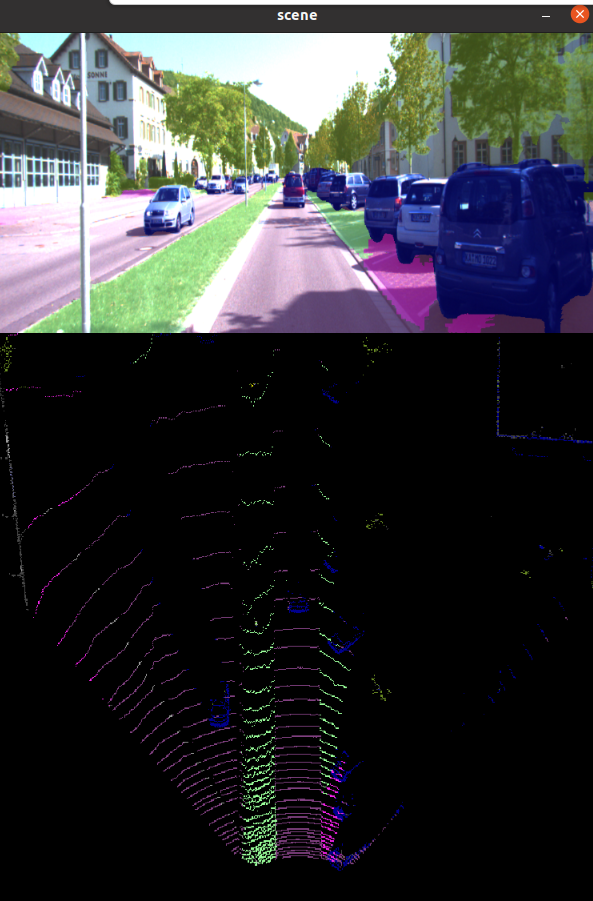
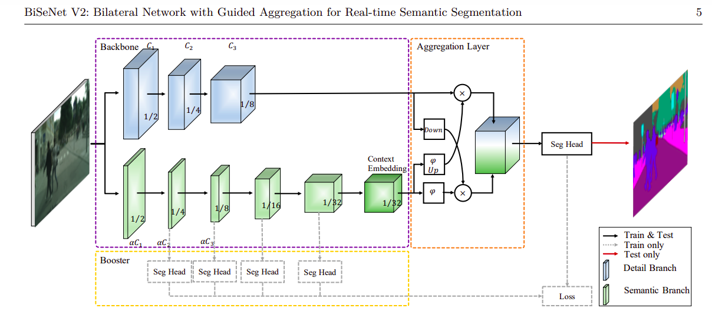
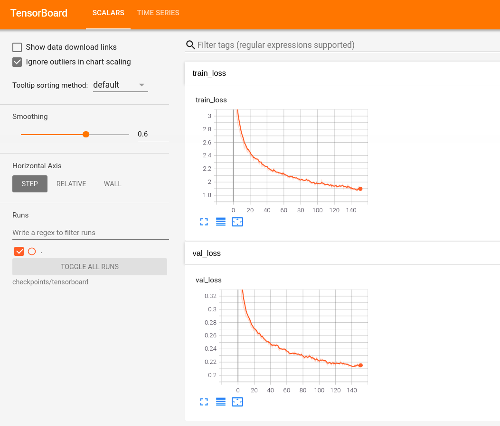
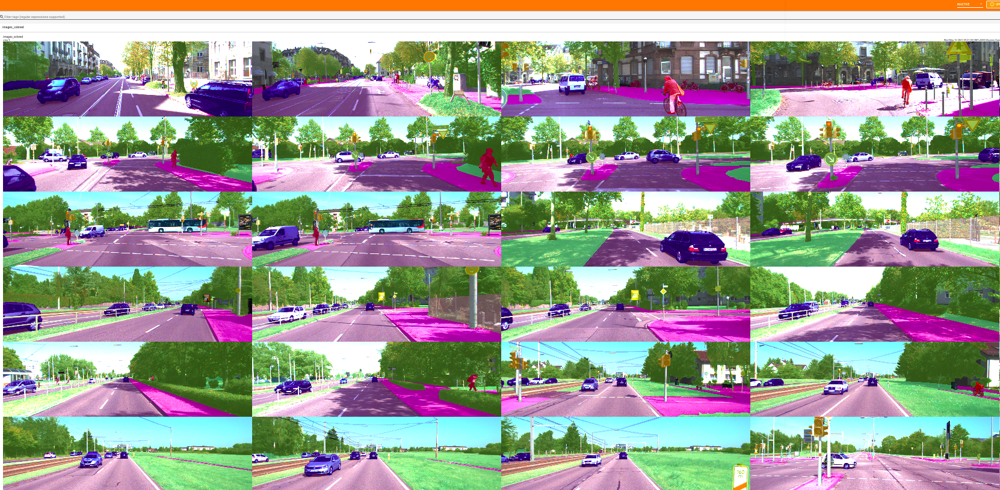

# PointPainting-Semantic-Segmentation

My unofficial implementation of [PointPainting Paper](https://arxiv.org/abs/1911.10150) for realtime pointcloud semantic segmentation painting (labeling each point with a class) based on semantic segmentation maps using [BiSeNetv2](https://arxiv.org/abs/1808.00897)

#### Project

- BiSeNetv2 model trained on KITTI dataset 
- Implementation of the pointpainting fusion algorithm

#### Demo Video


#### Run Demo
```python
python3 demo.py --image_path PATH_TO_IMAGE --pointcloud_path PATH_TO_POINTCLOUD --calib_path PATH_TO_CALIB --weights_path PATH_TO_MODEL_WEIGHTS

# note that default arguments are set to one of uploaded kitti samples so you can run it as
python3 demo.py
```


```python
# add --mode 3d to see a 3d visualization of painted pointcloud
python3 demo.py
python3 demo.py --mode 3d
```


#### Run Demo on Kitti Videos
Kitti Provides sequential videos for testing, Download them from [Kitti Videos]() by downloading video data(left & pointclouds)(download from [synced+rectified data]) and calibs (download from [calibration])
in the selected video


```python
# PATH_TO_VIDEO is path contains 'image_02' & 'velodyne_points' together
# PATH_TO_CALIB is path contains calib files ['calib_cam_to_cam', '', '']
# mode 2d to visualize image+bev .. 3d to visualize 3d painted pointcloud
python3 demo_video.py --video_path PATH_TO_VIDEO --calib_path PATH_TO_CALIB --mode 3d
```


## BiSeNetv2
Realtime semantic segmentation on images



Thanks to https://github.com/CoinCheung/BiSeNet for the implementation trained on CityScapes datasets.
I used it and finetuned it on KITTI dataset

### Training on KITTI dataset
```python
cd BiSeNetv2
python3 train.py 
```
I trained it on Colab and provided the [notebook](https://github.com/AmrElsersy/PointPainting/blob/master/BiSeNetv2/BiseNet_Train.ipynb) 




#### KITTI Dataset
Semantic KITTI dataset contains 200 images for training & 200 for testing <br>
Download it from [KITTI website](http://www.cvlibs.net/datasets/kitti/eval_semseg.php?benchmark=semantics2015)

```python
# visualize dataset on tensorboard
python3 visualization.py --tensorboard

# PATH_TO_TENSORBOARD_FOLDER is path "BiSeNetv2/checkpoints/tensorboard/"
tensorboard --logdir PATH_TO_TENSORBOARD_FOLDER
```



### References
- My Review https://docs.google.com/document/d/1AtpbLfCl_uL5BpwlYDgpdM_2WtCIucDrRomFjSp6bhg/edit

- Semantic Seg Overview :https://medium.com/beyondminds/a-simple-guide-to-semantic-segmentation-effcf83e7e54 .. https://medium.com/swlh/understanding-multi-scale-representation-learning-architectures-in-convolutional-neural-networks-a71497d1e07c

- Conv Types (Atrous, Transposed) https://towardsdatascience.com/types-of-convolutions-in-deep-learning-717013397f4d

- DeepLabv3 https://towardsdatascience.com/review-deeplabv3-atrous-convolution-semantic-segmentation-6d818bfd1d74

- Survay: Image Segmentation using Deep Learning https://arxiv.org/pdf/2001.05566.pdf
- Survay Article https://medium.com/swlh/image-segmentation-using-deep-learning-a-survey-e37e0f0a1489

- BiseNet (understanding spatial & context information) (good) https://prince-canuma.medium.com/spatial-path-context-path-3f03ed0c0cf5 .. https://medium.datadriveninvestor.com/bisenet-for-real-time-segmentation-part-i-bf8c04afc448

- Receptive field https://blog.christianperone.com/2017/11/the-effective-receptive-field-on-cnns/	
