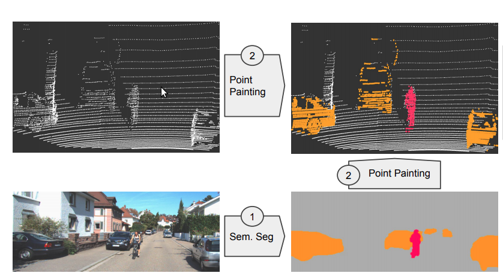
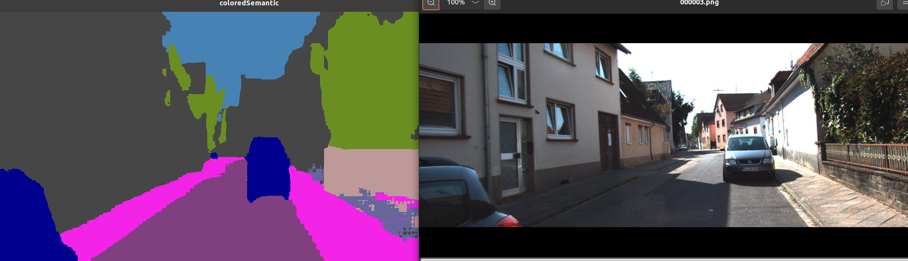
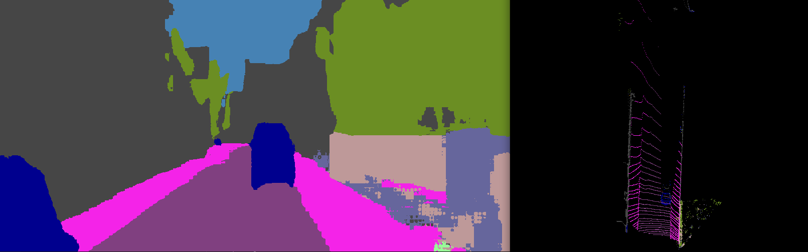
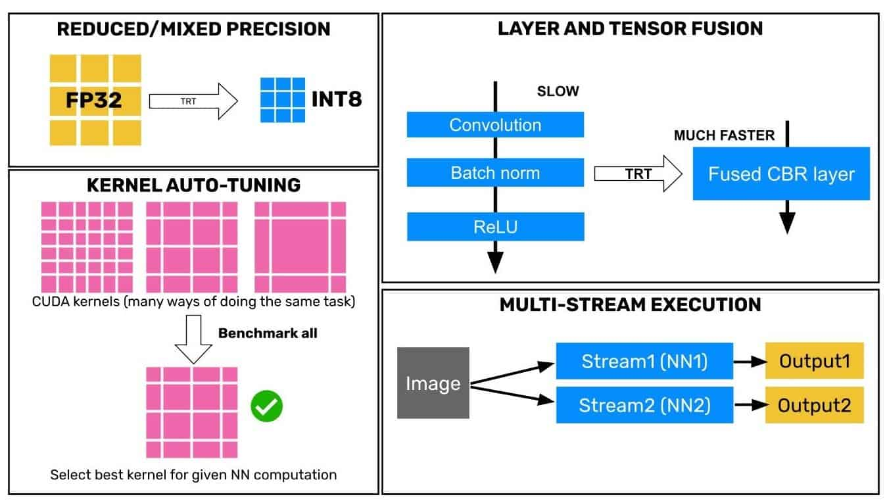

# TensorRT & CUDA for Point Painting

Optimized Inference for both Bisenetv2 for semantic segmentation using TensoRT & CUDA (`1.5x faster`), and the PointPainting Fusion algorithm using CUDA in C++ (`4x faster`)



# Run the project
First you need to get your GPU's tensorrt generated engine from the onnx format

First build the project

```bash
mkdir build
cd build
cmake ..
make
```
Then run the executable **convert_onnx_to_engine** with the path of the onnx file(which is located in the 'PointPainting/tensorrt_inference' folder), and another path to save the tensorrt engine at it(recommended to be at `tensorrt_inference/` path)

```bash
# replace PATH_TO_ONNX with onnx path which is '../'
# replace PATH_TO_TENSORRT with the path of saved tensorrt to generate it and save it at that path
./convert_onnx_to_engine PATH_TO_ONNX PATH_TO_TENSORRT
# example:
./convert_onnx_to_engine ../ ../
# or use the default paths(recommended)
./convert_onnx_to_engine
```

Then Run the main executable **pointpainting-tensorrt** located in the build directory (after you build using make)
```bash
./pointpainting-tensorrt
```

The code reads a sequence of test data located in 'tensorrt_inference/data' which is a samples from KITTI dataset (images & velodyne)

You will see output like this



### Visualize the output of point painting
Due to the lack of visualization tools in C++, I save the painted pointcloud(with semantic label channel) in the **data/results__pointclouds** path, and we can visualize the output of that by running the visualizer in the main project

```bash
cd ..
pwd
# ROOT/PointPainting
python3 visualizer.py
```
You will se output like that



Press any key to get the next saved result pointcloud

To visualize the output in 3D run
```bash
python3 visualizer.py --mode=3d
```


# Performance
### Bisenetv2 Semantic Segmentation
- The optimized TensorRT version of Bisenet runs at [**`22.5 FPS`**] while the Pytorch version runs at [**`14 FPS`**] which is **`1.5x Faster`** than Pytorch version

### Fusion Algorithm
- The PointPainting Fusion Algorithm takes [**`2.5 ms`**] on CUDA in C++ while the numpy version takes [**`10 ms`**] which is **`4x faster !`**

# Python TensorRT
Also there is a `Python interface` for `TensorRT & PyCUDA` whcih is fast but not faster than the C++ interface.

Check it at
- Python ONNX Runtime inference for bisenet @ [bisenet_onnx.py](../bisenet_onnx.py)
- Python TensorRT inference for bisenet @ [tensorrt_bisenet.py](../tensorrt_bisenet.py)

To see the difference in performance between the Python and C++ interfaces check the speed test numbers in [speed_test](../speed_test.txt)

# How TensorRT works


TensorRT optimizes the onnx computational graph of the model to get the maximum inference performance on your specific GPU.

It do things such as reduce precision (for example storing the float32 values as float16) or combining/fusing layers into one layer, and tuning the CUDA kernel parameters (num of blocks and num of threads), and multi-stream async execution

It do all that optimization techniques on you GPU to generate the optimized inference engine


## Folder structure
    ├── cuda_kernels
        ├── argmax_cuda.cu #contains cuda c++ kernel for argmax postprocesing
        ├── pointpainting_cuda.cu # contains cuda c++ kernel for pointpainting fusion algorithm
    ├── data  # contains data samples to try the model
        ├── image_2 # sample images from KITTI
        ├── velodyne # sample pointclouds  synchronized with the images
        ├── results_pointclouds # when you run ./pointpainting-tensorrt executable, it will save the painted pointclouds in that path, and you can run visualizer.py to test it
    ├── include
        ├── BisenetTensorRT.h
        ├── PointPainting.h
        ├── kernel_launch.h # definitions for kernel interface
        ├── pointcloud_io.h # common io operations to load/save pointclouds
        ├── visualization.h # semantic maps visualization
    ├── src
        ├── BisenetTensorRT.cpp
        ├── PointPainting.cpp
        ├── pointcloud_io.cpp
    ├──


# References
- TensorRT
    - https://docs.nvidia.com/deeplearning/tensorrt/developer-guide/index.html
    - https://learnopencv.com/how-to-run-inference-using-tensorrt-c-api/
    - https://learnopencv.com/how-to-convert-a-model-from-pytorch-to-tensorrt-and-speed-up-inference/

- CUDA C++
    - https://docs.nvidia.com/cuda/cuda-c-programming-guide/index.html
    - https://www.youtube.com/playlist?list=PLxNPSjHT5qvtYRVdNN1yDcdSl39uHV_sU
    - https://www.youtube.com/playlist?list=PLKK11Ligqititws0ZOoGk3SW-TZCar4dK

- My Pytorch PointPainting
https://github.com/AmrElsersy/PointPainting